# Sri Lankan Tourism Forecasting Model

**October 16, 2024**

## Table of Contents

- [Introduction](#introduction)
- [Dataset](#dataset)
- [Project Structure](#project-structure)
- [Installation](#installation)
- [Methodology](#methodology)
  - [Data Preprocessing](#data-preprocessing)
  - [Modeling Approaches](#modeling-approaches)
    - [Prophet](#prophet)
    - [SARIMA](#sarima)
    - [Exponential Smoothing](#exponential-smoothing)
    - [LSTM](#lstm)
  - [Cross-Validation](#cross-validation)
  - [Combining Forecasts](#combining-forecasts)
- [Results](#results)
  - [Mean Absolute Error (MAE)](#mean-absolute-error-mae)
  - [Visualizations](#visualizations)
    - [1. Forecasting Results with Combined Forecast](#1-forecasting-results-with-combined-forecast)
    - [2. Individual Model Forecasts](#2-individual-model-forecasts)
    - [3. Residuals Analysis](#3-residuals-analysis)
    - [4. MAE Comparison](#4-mae-comparison)
- [License](#license)
- [Acknowledgments](#acknowledgments)

## Introduction

Tourism plays a vital role in Sri Lanka's economy, contributing significantly to GDP, employment, and foreign exchange earnings. Accurate forecasting of tourist arrivals is essential for strategic planning, resource allocation, and marketing initiatives. This project leverages multiple time-series forecasting models to predict monthly tourist arrivals in Sri Lanka from 2014 to 2024. By combining forecasts from various models, the project aims to enhance prediction accuracy and provide robust insights for stakeholders.

## Dataset

The dataset used in this project comprises monthly tourist arrival figures in Sri Lanka from January 2014 to October 2024. The data is sourced from [SLTDA](https://www.sltda.gov.lk/en/statistics) and includes the following columns:

- **Year**: The year of the record.
- **Month**: The month of the record.
- **Arrivals**: Number of tourist arrivals.
- **PercentageChange**: Monthly percentage change in arrivals (dropped during preprocessing).

## Project Structure

```
Sri_Lankan_Tourism_Forecasting/
├── dataset/
│   └── 2014-2024-monthly-tourist-arrivals-sl-csv.csv
├── images/
├── notebooks/
│   └── Sri_Lankan_Tourism_Forecasting.ipynb
├── README.md
└── requirements.txt
```


## Installation

To set up the project locally, follow these steps:

1. **Clone the Repository**

   ```bash
   git clone https://github.com/dev-achintha/Sri_Lanka-Tourism_Forcasting_Model
   cd Sri_Lanka-Tourism_Forcasting_Model
   ```

2. **Create a Virtual Environment**

   It's recommended to use a virtual environment to manage dependencies.

   ```bash
   python3 -m venv venv
   source venv/bin/activate  # On Windows: venv\Scripts\activate
   ```

3. **Install Dependencies**

   ```bash
   pip install -r requirements.txt
   ```

   *If `requirements.txt` is not available, install the necessary packages manually:*

   ```bash
   pip install pandas numpy matplotlib scikit-learn prophet statsmodels keras tensorflow
   ```

4. **Run the Jupyter Notebook**

   ```bash
   jupyter notebook notebooks/Sri_Lankan_Tourism_Forecasting.ipynb
   ```

## Methodology

The forecasting project employs four distinct models to predict monthly tourist arrivals:

1. **Prophet**
2. **Seasonal ARIMA (SARIMA)**
3. **Exponential Smoothing**
4. **Long Short-Term Memory (LSTM) Neural Network**

To ensure the robustness of the models, time-series cross-validation is performed. Finally, forecasts from all models are combined to potentially achieve better accuracy than individual models.

### Data Preprocessing

- **Data Cleaning**: The `PercentageChange` column is dropped if present.
- **Date Formatting**: A new datetime column `ds` is created by combining `Year` and `Month`, formatted as `%Y-%B`.
- **Renaming Columns**: The `Arrivals` column is renamed to `y` to comply with Prophet's naming conventions.
- **Sorting and Indexing**: The DataFrame is sorted by date and reset to ensure proper ordering.

### Modeling Approaches

#### Prophet

Prophet is a decomposable time-series model developed by Facebook, known for handling seasonality and holidays with ease.

- **Configuration**:
  - Yearly and weekly seasonality enabled.
  - Daily seasonality disabled.
  - Added custom monthly seasonality.
  - Changepoint prior scale set to 0.1 to control flexibility.
  - Number of changepoints set to 30.

- **Forecasting**: Generates future data points with a monthly frequency.

#### SARIMA

Seasonal ARIMA models cater to both non-seasonal and seasonal data patterns.

- **Configuration**:
  - Order set to (1, 1, 1) for non-seasonal components.
  - Seasonal order set to (1, 1, 1, 12) to account for yearly seasonality.

- **Forecasting**: Produces future values based on the fitted SARIMA model.

#### Exponential Smoothing

This technique models data with trend and seasonality components.

- **Configuration**:
  - Additive trend and seasonality.
  - Seasonal periods set to 12 to capture annual seasonality.

- **Forecasting**: Generates future points using the fitted model.

#### LSTM

Long Short-Term Memory networks are a type of recurrent neural network capable of learning long-term dependencies.

- **Configuration**:
  - Data scaling using Min-Max Scaler.
  - Sequence length set to 12 (past 12 months).
  - LSTM layer with 50 units and ReLU activation.
  - Dense output layer.
  - Compiled with Adam optimizer and Mean Squared Error loss.
  - Trained for 50 epochs with a batch size of 32.

- **Forecasting**: Iteratively predicts future values by feeding previous predictions back into the model.

### Cross-Validation

Time-series cross-validation is employed to evaluate model performance.

- **Initial Training Size**: All models are initially trained on data excluding the last 24 observations (approximately two years).
- **Horizon**: Forecasting is performed 6 months ahead in each fold.
- **Process**:
  - The dataset is split into training and testing sets based on the initial size and horizon.
  - Each model is trained on the training set and forecasts the next 6 months.
  - This process is repeated across multiple folds to ensure robust evaluation.

### Combining Forecasts

To potentially enhance forecasting accuracy, predictions from all individual models are combined by averaging their outputs. This ensemble approach leverages the strengths of each model, mitigating individual weaknesses.

## Results

### Mean Absolute Error (MAE)

MAE is used as the primary metric to evaluate the accuracy of forecasts.

| Model                  | MAE        |
|------------------------|------------|
| Prophet                | 79,235.70  |
| SARIMA                 | 30,043.37  |
| Exponential Smoothing  | 33,822.78  |
| LSTM                   | 35,437.68  |
| **Combined Model**     | **33,960.23** |

**Interpretation**:

- **SARIMA** exhibits the lowest MAE among individual models, indicating high accuracy.
- **Prophet** has the highest MAE, suggesting it may be less suited for this particular dataset.
- **Combined Model** achieves a MAE comparable to Exponential Smoothing and LSTM, benefiting from averaging multiple models.

### Visualizations

#### 1. Forecasting Results with Combined Forecast

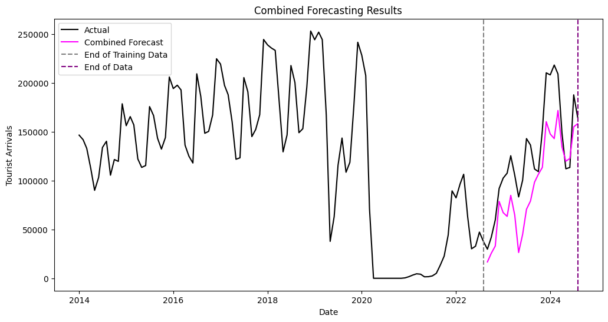

*This plot showcases the actual tourist arrivals alongside the predictions from each individual model (Prophet, SARIMA, Exponential Smoothing, LSTM) and the combined forecast. Two vertical dashed lines indicate the end of the training data (**Gray**) and the end of the entire dataset (**Purple**).*

#### 2. Individual Model Forecasts

Each model's forecasting results are visualized separately to provide detailed insights into their performance.

- **Prophet**

  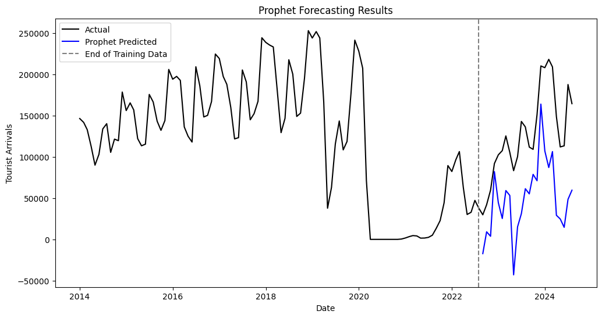

- **SARIMA**

  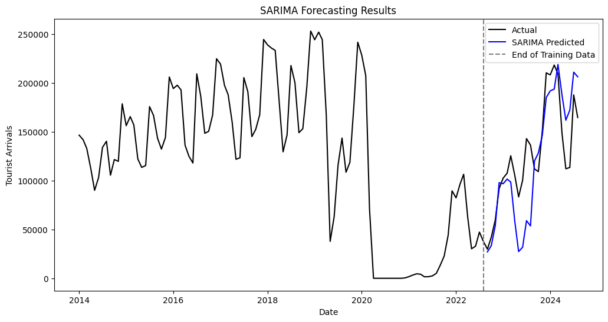

- **Exponential Smoothing**

  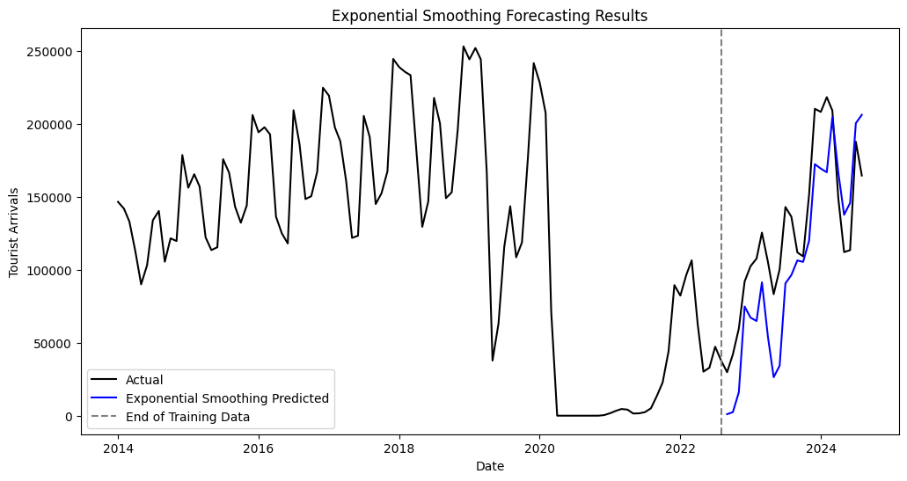

- **LSTM**

  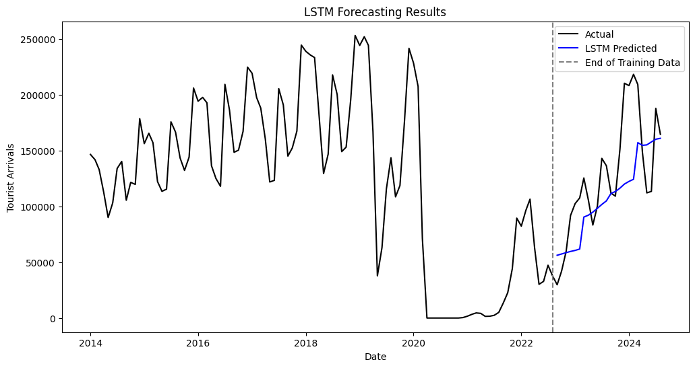

*These plots display the actual tourist arrivals and the respective model's predictions, along with a vertical dashed line marking the end of the training data.*

#### 3. Residuals Analysis

Residuals (Actual - Predicted) help in assessing the accuracy and reliability of each model.

- **Prophet Residuals**

  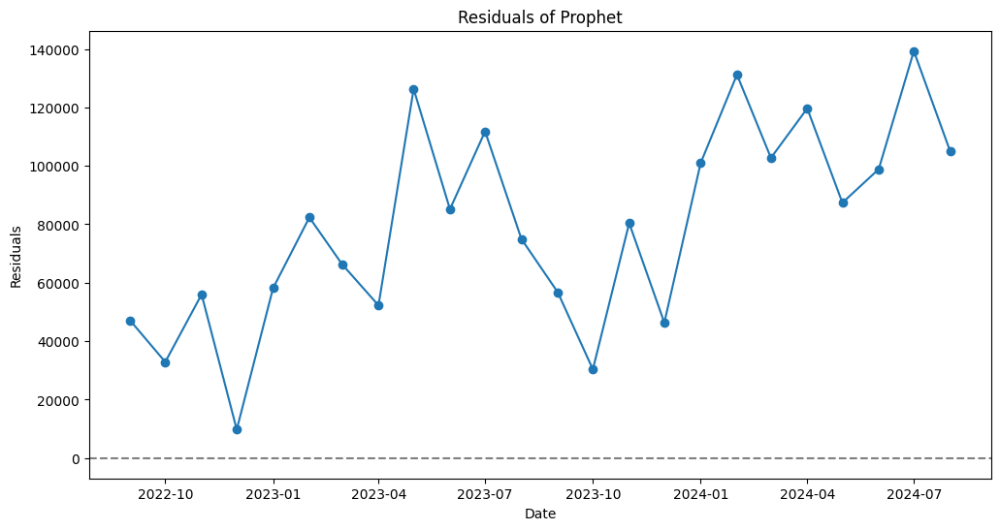

- **SARIMA Residuals**

  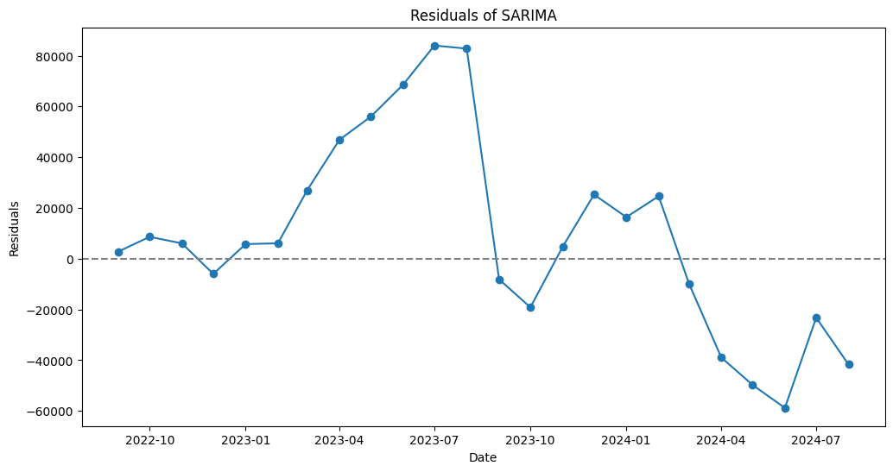

- **Exponential Smoothing Residuals**

  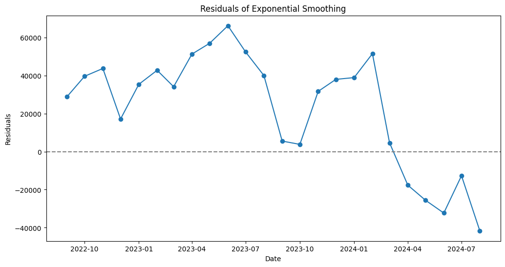

- **LSTM Residuals**

  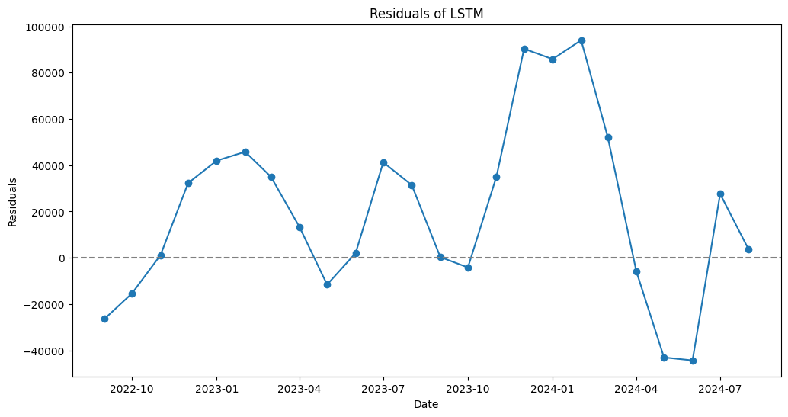

- **Combined Model Residuals**

  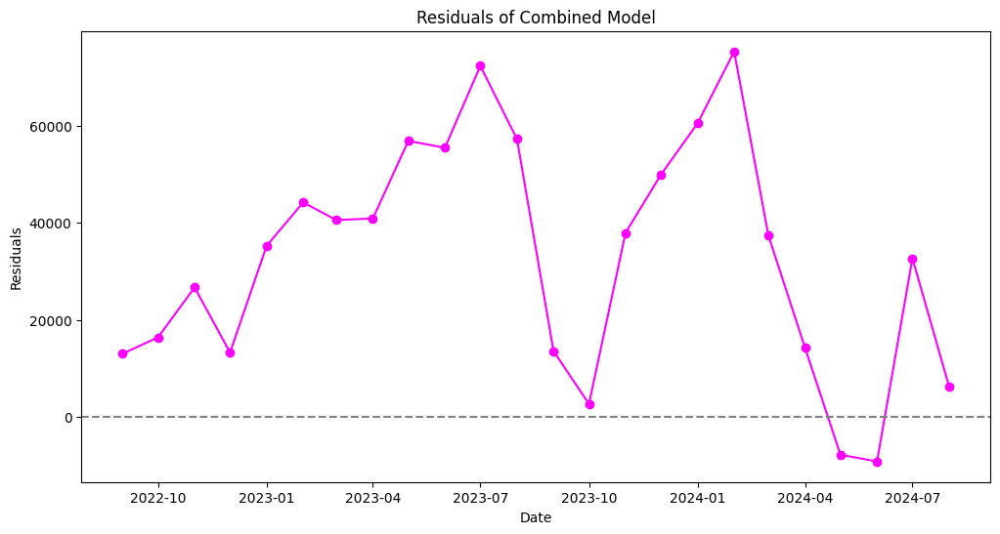

*These residual plots illustrate the discrepancies between actual values and model predictions. A horizontal dashed line at zero indicates perfect predictions.*

#### 4. MAE Comparison

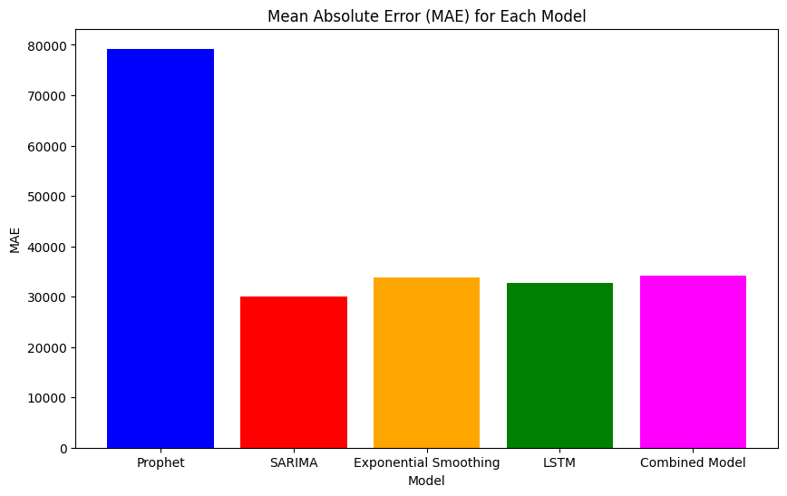

*This bar chart compares the Mean Absolute Error (MAE) of each individual model and the combined model, providing a clear visual representation of their relative performances.*

## License

This project is licensed under the [MIT License](LICENSE).

## Acknowledgments

- **Prophet**: Developed by Facebook's Core Data Science team.
- **SARIMA and Exponential Smoothing**: Implemented using `statsmodels`.
- **LSTM**: Built with `Keras` and `TensorFlow`.
- **Data Source**: Provided by [SLTDA](https://www.sltda.gov.lk/en/statistics)
- **Open-Source Libraries**: Pandas, NumPy, Matplotlib, Scikit-learn, Keras, TensorFlow, and more.